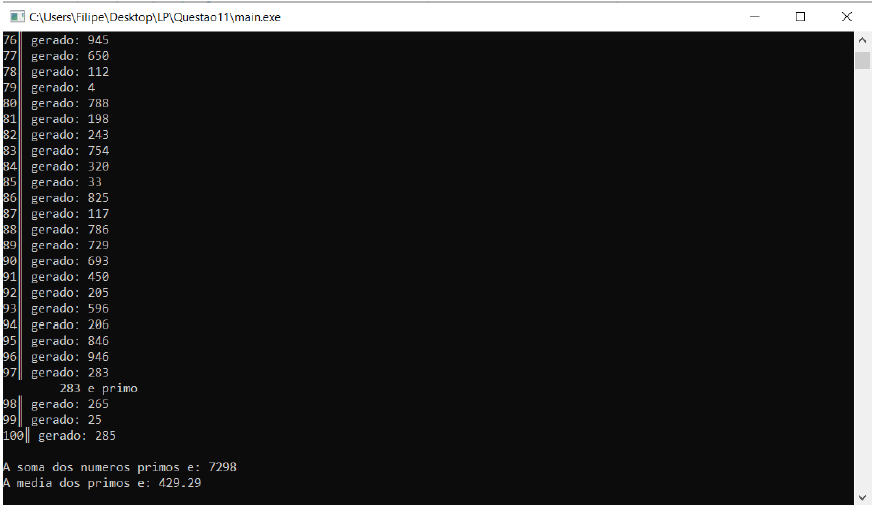

# Gerador-2.0
### Programa capaz de gerar de forma automática e aleatória 100 números inteiros positivos entre 0 e 1000 e que apresente na consola a soma e média dos primos existentes no conjunto criado. Mas que o teste de verificação de primo seja feito dentro de uma função
Trabalho desenvolvido para cimentar os conhecimentos adquiridos nas cadeiras de Linguagens de Programação e Algoritmos e Estruturas de Dados.

**O objetivo da aplicação consiste em gerar de forma automática e aleatória 100 numeros positivos entre 0 e 1000 e apresentar na consola a soma e a média dos números primos existentes no conjunto criado**

Se quiser utilizar o programa basta:
* Executar o ficheiro denominado "main.exe".

Aqui tem um exemplo do programa em execução:

